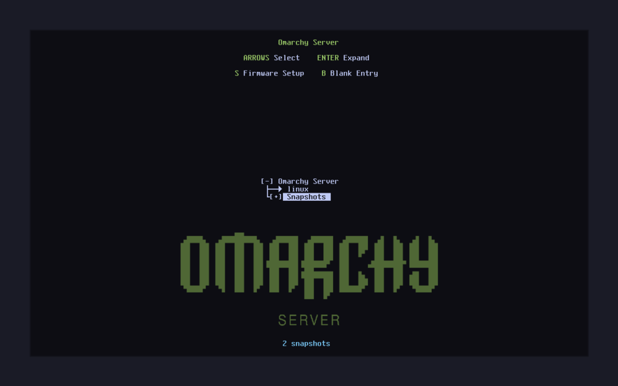
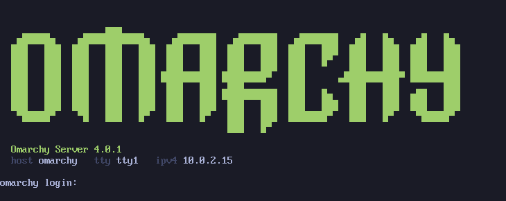
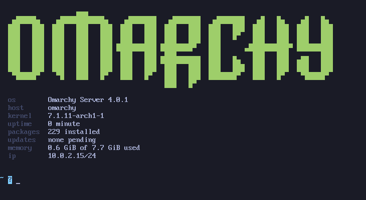
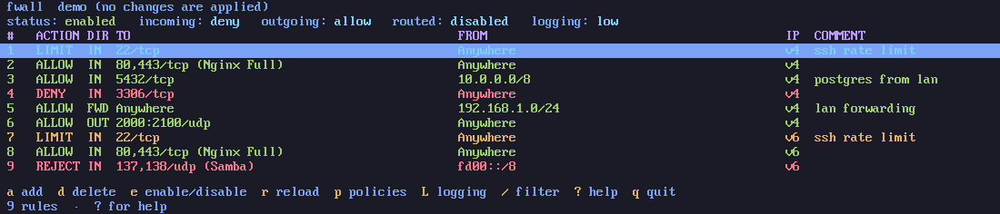

# Omarchy identity on a headless machine, at zero new packages

**Date:** 2026-08-29
**Subject:** bootloader branding, `/etc/issue`, VT palette, MOTD, `os-release`
**Result:** **33/33** acceptance checks pass; the base install is still 220 packages / 1402 MiB

## Scope

A server installed from this profile looked like plain Arch: Limine's default
menu, `Arch Linux \r (\l)` on the console, no message of the day. The edition
was visible only to someone who ran pacman.

The constraint was that fixing it must not add a package, because a package is
attack surface and fewer packages is the premise of the profile. Everything here
is therefore configuration, two small commands and a 17 KB image.

## Environment

| | |
|---|---|
| ISO | `omarchy-2026.08.29-x86_64-server-local.iso` |
| VM | `srv` — QEMU/KVM `q35`, 4 vCPU, 8 GiB RAM, 40 GiB virtio disk, OVMF 4M without Secure Boot |
| Autoinstall | `mkcidata.sh --profile server`, **no `--hostname`**, so the drive carries no `hostname` key and the profile default is exercised |
| Second VM | `srvf`, installed with `mkcidata.sh --profile server --addons fwall` |
| Installed | kernel `7.1.11-arch1-1`, `omarchy-version` `4.0.1-1` |

## Method

A fresh install from the rebuilt ISO, then `collect.sh`, `surface.sh`,
`acceptance.sh` and `reboot-check.sh` as usual. The three screenshots were taken
from this VM: the console and the MOTD with `vm.sh srv screenshot`, and the
Limine menu by holding it open with `sendkey down` through the QEMU monitor —
any keypress cancels the two-second countdown — and screenshotting at leisure.
The MOTD is a real login shell on tty3, opened with
`openvt -c 3 -f -s -- su - omarchy`.

## Results

| Surface | What lands | Shipped by |
|---|---|---|
| Bootloader | `interface_branding: Omarchy Server`, `timeout: 2`, Tokyo Night palette, `wallpaper: boot():/limine-wallpaper.png`, `wallpaper_style: stretched` | `default/limine/limine.conf` + `limine-branding-server.sh` |
| Console, before login | `/etc/issue`: the logo in Tokyo Night green, version, hostname, tty, IPv4 | `etc-overrides/issue`, applied by the install scriptlet |
| Serial console | the same fields, no logo | `/etc/issue.serial` + a `serial-getty@.service.d` drop-in |
| Every VT | the Tokyo Night palette, applied before getty | `omarchy-tty-palette` + its oneshot unit |
| After login | the MOTD | `/etc/profile.d/omarchy-motd.sh` → `omarchy-server-motd` |
| Everywhere | `NAME`, `PRETTY_NAME`, `ID`, `ID_LIKE`, `ANSI_COLOR`, `LOGO` | `etc-overrides/os-release` |

**33 of 33 acceptance checks pass.** The ten that are new here, with their
recorded evidence:

| Item | Evidence |
|---|---|
| `/etc/omarchy-profile` is `server` | `server` |
| `omarchy-version` | `4.0.1-1` |
| hostname defaults to `omarchy` when the drive gives none | `hostnamectl hostname` → `omarchy`, `default-hostname-ok` |
| `os-release` identifies the edition | `NAME="Omarchy Server"`, `PRETTY_NAME="Omarchy Server 4.0.1"`, `ID=omarchy-server`, `ID_LIKE="omarchy arch"`, `ANSI_COLOR="0;32"`, `LOGO=omarchy` |
| `/etc/issue` carries logo, version and machine fields | 14 non-empty lines, block-drawing art, `\S{VERSION_ID}`, a literal `ESC [32m` |
| the serial console gets its own logo-free issue | `/etc/issue.serial` has no art; the drop-in carries `issue-file /etc/issue.serial` |
| the palette unit ran and left the serial console alone | `enabled`, `active`, `ExecMainStatus 0`, no `ttyS` anywhere in the command |
| `limine.conf` is branded, waits 2 s, points at the wallpaper | `timeout: 2`, `interface_branding: Omarchy Server`, `wallpaper: boot():/limine-wallpaper.png` — checked **after** `limine-snapper-sync` regenerated the entries |
| the wallpaper is on the ESP | `/boot/limine-wallpaper.png`, 17941 B, `PNG image data, 1920 x 1080, 8-bit/color RGB` |
| the login banner prints, and is wired into every login shell | `os Omarchy Server 4.0.1 / host omarchy / kernel 7.1.11-arch1-1 / packages 220 installed / updates none pending / memory 0.7 GiB of 7.7 GiB / ip 10.0.2.15/24`; `/etc/profile.d/omarchy-motd.sh` calls `omarchy-server-motd` |

**Package cost: zero.** The base install measures the same 220 packages and
1402 MiB it did before. The only new files are configuration, two commands
(`omarchy-tty-palette`, `omarchy-server-motd`), one oneshot unit and the
wallpaper.

**Boot cost: two seconds, deliberately.** `timeout` went from 0 to 2 so the menu
is reachable without holding a key on a machine nobody is standing in front of.
The loader goes from 0.67 s to 2.6–2.8 s, the whole boot from 4.8 s to
6.7–7.0 s.

**The `fwall` addon**, also introduced here, was verified on VM `srvf`:
`fwall 0.1.0-1`, 3.69 MiB, MIT; package count 221, exactly one more than the
base; `fwall --version` → `fwall 0.1.0`; `/etc/fwall/config.toml` →
`backend = "ufw"`; `fwall --demo` renders on the console in the same palette.

## What it looks like

The branded Limine menu:



`/etc/issue` on tty1, before login:



The MOTD, after login:



`fwall` on the console of the second VM:



The serial console gets the same fields without the 81-column logo. Byte for
byte from the VM's serial line, with the escape sequences shown as `^[`:

```
^[[1;32mOmarchy Server^[[0m ^[[32m4.0.1^[[0m
^[[2mhost^[[0m omarchy   ^[[2mtty^[[0m ttyS0   ^[[2mipv4^[[0m 10.0.2.15

omarchy login:
```

## Evidence

- [`../pocs/server-install/reference/acceptance.txt`](../pocs/server-install/reference/acceptance.txt) — the raw PASS/FAIL evidence
- [`../pocs/server-install/reference/console.png`](../pocs/server-install/reference/console.png) — the console as the VM rendered it
- [`../pocs/server-install/reference/serial-issue.txt`](../pocs/server-install/reference/serial-issue.txt) — the serial banner, byte for byte
- [`../pocs/server-install/reference/system.txt`](../pocs/server-install/reference/system.txt) — kernel, `os-release`, profile marker
- [`../docs/packaging.md`](../docs/packaging.md) §2.5 — the design, file by file
- [`../docs/iso-server.md`](../docs/iso-server.md) §5, §6 — the limine timeout, and the branding of the live medium

## Findings and bugs

Two wallpaper traps, both of which fail **silently**, found by looking at the
screen rather than by reading documentation:

1. **`term_background` is `TTRRGGBB`, and a six-digit value means opaque.**
   `term_background: 1a1b26` paints an opaque panel over the whole terminal area
   and the wallpaper never appears, with no error anywhere. `80000000` lets it
   through at half strength and keeps the menu text legible.
2. **`wallpaper_style: centered` crops an image larger than the framebuffer.**
   The artwork is 1920×1080 and a VM console is commonly 1280×800. `stretched`
   is right for a wordmark on a flat field.

Limine reads BMP, PNG, JPEG and QOI and **skips a wallpaper it cannot read
instead of panicking** — which is what makes the install leaf safe to be
best-effort, and also what makes every mistake above look identical from the
outside.

Three more worth recording:

3. **`/etc/issue` needs literal ESC bytes.** agetty copies an issue file out
   verbatim except for its own backslash sequences, and `\e` is not one of them.
   `\S{VERSION_ID}`, `\n`, `\l` and `\4` are, and agetty expands them into the
   version, hostname, tty and first IPv4 address.
4. **The logo is 81 columns wide, 83 with its indent.** Right for a video
   console, wrong for a serial line where 80 columns is the contract and every
   row would wrap by one character. Hence the separate `/etc/issue.serial`.
5. **The branding must live in the template, not in the ESP's copy.**
   `limine-entry-tool` and `limine-snapper-sync` add and remove entries below the
   header on every snapshot, and `omarchy-refresh-limine` rewrites the file from
   `default/limine/limine.conf`. The acceptance check deliberately runs **after**
   a snapshot has been created, to prove the branding survived regeneration.
6. **The MOTD cannot assume fastfetch.** `omarchy-server-motd` execs it when it
   is installed (the `cli-tools` addon brings it), and otherwise renders the same
   fields from what `base` already has. Terminal width comes from
   `stty size </dev/tty`, not `$COLUMNS` or `tput cols`: this runs out of
   `/etc/profile`, before bash has necessarily set the variable, and on a fresh
   VT `$TERM` may not be set either. Below 83 columns the logo is dropped.

## Limitations

- The palette unit never touches `/dev/ttyS0` by design: on a serial line the
  terminal at the far end owns its colours, and the escape would be printed as
  garbage into whatever is logging the port. That means the serial console is
  identified but not themed.
- `/etc/issue.net` ships as two plain lines and nothing enables it. An ssh
  `Banner` is an owner's decision.
- Pending updates in the MOTD come from `pacman -Qu`, a query against the sync
  database already on disk — not `checkupdates`, which would download a database
  on every login of a machine that may be on a metered link. It can therefore be
  stale.
- The installer dashboard is untouched and still shows desktop tips during a
  server install.

## Next steps

- Give an installed machine somewhere to fetch `fwall` and profile fixes from:
  today the package exists only inside the ISO's offline mirror.
